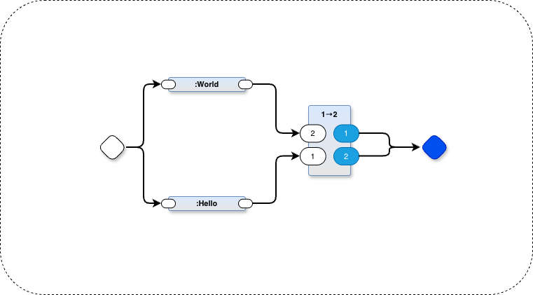

# Concurrent Hello World in PBP (Parts Based Programming)

This looks very simple, but contains concurrency and parallelism and a way to reason about mevent (message-event) ordering.

2 Parts to make Hello World.

A 3rd Part to guarantee ordering of mevents.

# Usage
`make`

View the source code by opening `helloworld.drawio` in the [drawio](https://www.drawio.com) editor.

# Do It Yourself

If you'd like to build a PBP project from scratch, I recommend using the pbp-kit template to create a fresh repo, then creating your own version of the drawing and running `make`.

## Links
- https://github.com/guitarvydas/pbp-kit PBP kit template
- https://github.com/guitarvydas/pbp_helloworld finished project in video
- https://www.drawio.com Draw.io diagram editor

## Video
https://www.youtube.com/watch?v=EFTzFA82YRc&list=PLHh2_dCKBPjbBN2R8xwBiS4nHlo5iQjqS&index=1

## Steps
- create new project using the pbp-kit template
- git clone the project locally
- cd into the new project
- edit Makefile - change `???` to `helloworld`
- `make init`
- open draw.io (see above to download and install) and name the drawing `helloworld`
- change name of tab to `main` (arbitrary name, but must correspond with argv 3 of python line in Makefile)
- `make`

# UTF-8
Some of the Part names contain Unicode. 

You may need to enable Unicode before running `make` using this version of PBP.

In Linux/Mac:
`export PYTHONUTF8=1`

In Windows:
`set PYTHONUTF8=1`

